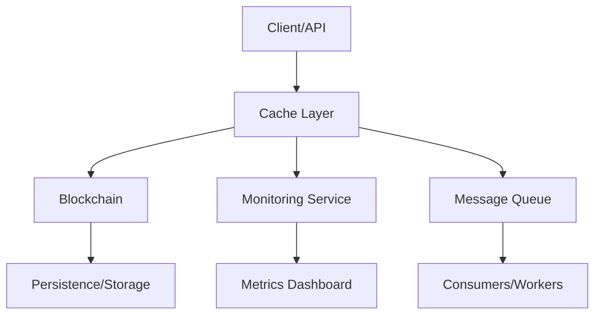

# 🚀 Big Data Software Architecture Playground

[](https://www.java.com/)
[](https://junit.org/)
[](https://gradle.org/)
[](https://www.docker.com/)
[](https://mermaid-js.github.io/)
[](LICENSE)

---

## 📝 Overview

This repository is a comprehensive, production-grade Java project inspired by the [University of Colorado Boulder's "Fundamentals of Software Architecture for Big Data"](https://www.coursera.org/learn/fundamentals-of-software-architecture-for-big-data) course.

Each module demonstrates advanced software engineering, distributed systems, monitoring, and messaging solutions with real-world code, TDD, and deep documentation. All core data structures are implemented from scratch—**no built-in Java collections are used for the main logic**.

---

## 📚 Table of Contents

- [Modules](#modules)
- [Technologies Used](#technologies-used)
- [Project Structure](#project-structure)
- [Architecture Diagram](#architecture-diagram)
- [How to Run](#how-to-run)
- [Contributing](#contributing)
- [Lessons Learned](#lessons-learned)
- [License](#license)

---

## 🧩 Modules

### 1. 🗃️ Software Engineering Overview (Aged Cache)
- **Goal:** Implement a custom O(1) cache with TTL-based eviction, no built-in collections, full TDD, and concurrency support.
- **Highlights:**  
  - Custom hash table and linked list for storage  
  - Thread-safe operations  
  - Expiry and eviction logic
- **Usage Example:**
  ```java
  SimpleAgedCache cache = new SimpleAgedCache();
  cache.put("key", "value", 1000);
  Object value = cache.get("key");
  ```

### 2. 🔗 Fundamentals of Software Architecture (Blockchain)
- **Goal:** Build a custom singly linked list blockchain with SHA-256 hashing, genesis block, and chain validation.
- **Highlights:**  
  - No built-in List/Map  
  - Genesis block auto-creation  
  - Block linking and hash validation  
  - Tampering and edge-case tests
- **Usage Example:**
  ```java
  Blockchain chain = new Blockchain();
  chain.addBlock("data");
  Block latest = chain.getLatestBlock();
  ```

### 3. 📈 Production Software Fundamentals (Monitoring)
- **Goal:** Thread-safe service monitoring, background job simulation, and real-time metrics with stress and concurrency tests.
- **Highlights:**  
  - Service availability calculation  
  - Background job scheduler  
  - Metrics reset and stress tests  
  - Concurrency and edge-case handling
- **Usage Example:**
  ```java
  MonitoringService service = new MonitoringService();
  service.recordRequest(true);
  double availability = service.getAvailability();
  ```

### 4. 📬 Production Databases & Messaging (Message Queue)
- **Goal:** Custom message queue with thread-safety, capacity management, and advanced test coverage.
- **Highlights:**  
  - Custom queue (no built-in collections)  
  - Enqueue/dequeue with capacity checks  
  - Thread-safe, stress and concurrency tests
- **Usage Example:**
  ```java
  MessageQueue<String> queue = new MessageQueue<>(10);
  queue.enqueue("msg");
  String msg = queue.dequeue();
  ```

---

## 🛠️ Technologies Used

[](https://www.java.com/)
[](https://junit.org/)
[](https://gradle.org/)
[](https://www.docker.com/)
[](https://mermaid-js.github.io/)

---

## 🗂️ Project Structure

```
Parallel-Programming-in-Java/
├── miniproject_0/
├── miniproject_1/
├── miniproject_2/
├── miniproject_3/
├── miniproject_4/
├── quiz1.pdf
├── quiz2.pdf
├── quiz3.pdf
├── quiz4.pdf
└── README.md
```

---

## 🏗️ Architecture Diagram



---

## 🚀 How to Run

1. **Clone the repository:**
   ```bash
   git clone https://github.com/aliagasiyev/big-data-software-architecture-playground.git
   cd big-data-software-architecture-playground
   ```
2. **Build and test:**
   ```bash
   ./gradlew build
   ```
3. **Explore each module's README for technical deep-dives and usage examples.**

---

## 🤝 Contributing

Contributions are welcome! Please open an issue or submit a pull request.

---

## 🎓 Lessons Learned

- Deep understanding of custom data structures and thread-safety in Java
- Real-world application of TDD and advanced testing strategies
- Architectural trade-offs in distributed systems and Big Data
- Documentation, code clarity, and professional project structure

---

## 📝 License

[](LICENSE)

---

**Happy coding! 🚀** 
