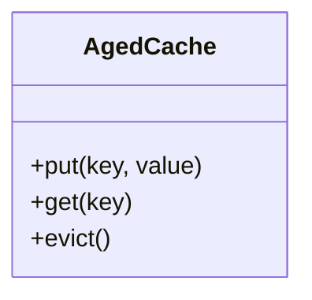

# Module: Cache (AgedCache)

## Purpose
This module implements an efficient, test-driven Aged Cache (LRU/TTL) in Java.

## Technical Features
- O(1) get/put operations
- Automatic eviction based on age (TTL)
- Thread-safe (if applicable)
- Fully tested with JUnit 5

## Architecture Diagram


## Usage Example
```java
AgedCache<String, Integer> cache = new AgedCache<>(100, Duration.ofSeconds(60));
cache.put("foo", 42);
Integer value = cache.get("foo");
```

## Tests
- JUnit tests for all core operations
- Verification of TTL and eviction logic

## Lessons Learned
- Practical application of TDD
- Comparison of cache eviction strategies
